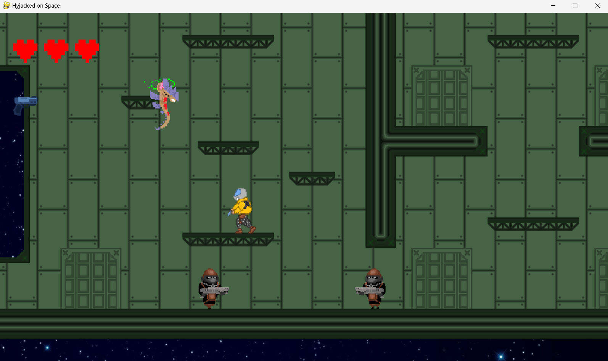
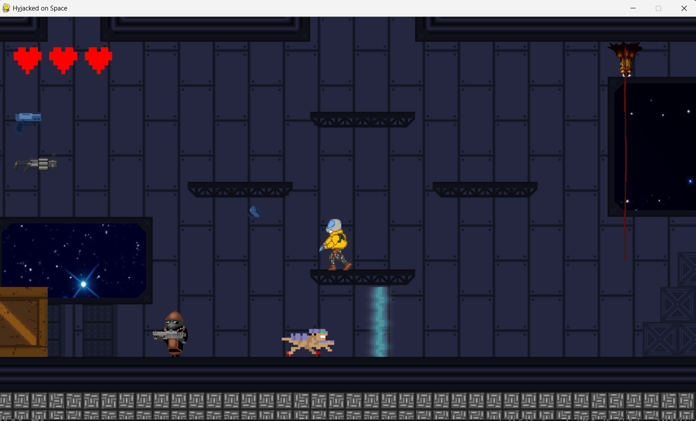
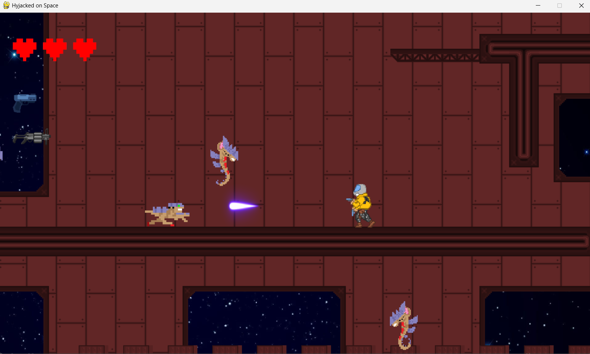
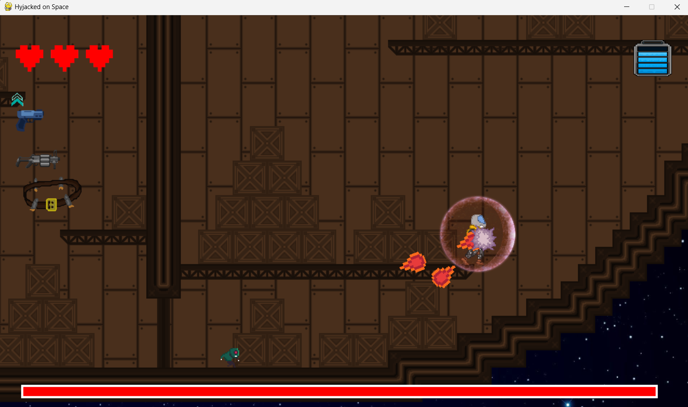

# HyjackedOnSpace2D

A 2D action-adventure video game set in space where you need to fight aliens as they appear, and battle various bosses and hordes across a total of 4 levels. 
Made with Pygame.

## Controls

### Keyboard:
- **A, D**: Player movement
- **Space**: Jump (hold to jump higher)
- **Arrow Keys**: Aim with the gun
- **G, H**: Throw a grenade to the left/right
- **E**: Interact
- **W, S**: Set dash direction up/down
- **Left Shift**: Dash in one of the 8 directions (W, A, S, D)
- **F**: Activate shield

### Gamepad:
- **Left Joystick**: Move
- **Right Joystick**: Shoot
- **Triangle**: Interact
- **X**: Jump
- **Square**: Throw grenade to the left
- **Circle**: Throw grenade to the right
- **Square**: Shield (yes, also throws a grenade)
- **L1/R1**: Dash
- **D-Pad**: Navigate menus

# Preview

  
  
  
  

## Contributors
- **Juan Villaverde Rodriguez**: [GitHub](https://github.com/JuanVillaverdeRodriguez)
- **Oscar Castillo Fernandez**: [GitHub](https://github.com/oscar-castillo)
- **Carlos Rojo**: [GitHub](https://github.com/carlosrojoudc)
